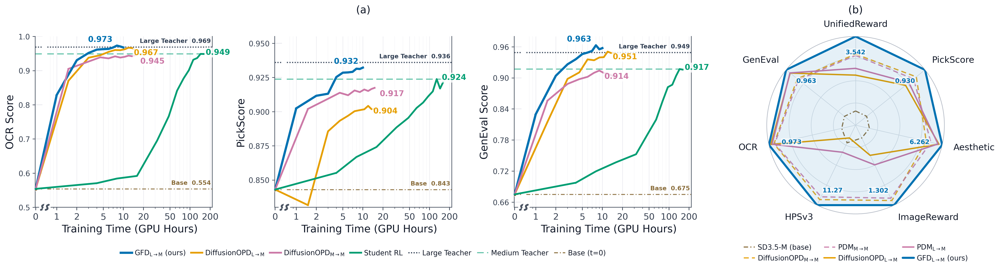
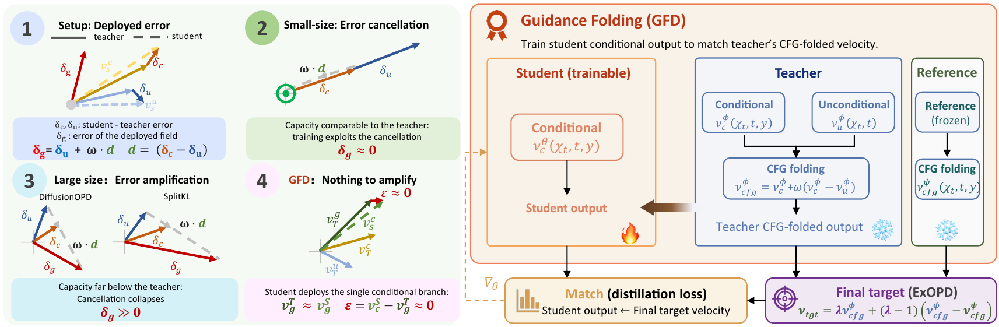

# GFD-OPD: Guidance-Folded On-Policy Distillation of Diffusion Models Across Scales

[](https://arxiv.org/abs/2609.39692)

Official implementation of **GFD-OPD**, a simple recipe for **large-to-small on-policy distillation of diffusion models** (e.g. SD3.5-Large → SD3.5-Medium, FLUX.2-32B → FLUX.2-4B).

> 🚧 **Code and checkpoints are coming soon** (within one week). Star / watch the repo to get notified.

<p align="center">
  
</p>

## Overview

Standard diffusion OPD breaks down when the student is smaller than the teacher: the student cannot fully match the teacher, and classifier-free guidance amplifies the remaining mismatch at sampling time, producing visible artifacts. GFD-OPD fixes this by training the student's single conditional branch on the teacher's **CFG-folded velocity** (so there is nothing left for guidance to amplify) and **extrapolating the target beyond the teacher** to push the student further.

<p align="center">
  
</p>

**Results.** Distilling SD3.5-Large into SD3.5-Medium, GFD-OPD removes the artifacts of prior recipes, ranks first on all seven metrics (task rewards and image quality), surpasses the large teacher on GenEval and OCR, and overtakes all baselines within ~10 GPU-hours. The same holds for FLUX.2-9B / 32B → 4B.

## Roadmap

- [ ] Training code (SD3.5 and FLUX.2)
- [ ] Distilled student checkpoints
- [ ] Evaluation scripts

## Citation

```bibtex
@misc{zhang2026gfdopdguidancefoldedonpolicydistillation,
      title={GFD-OPD: Guidance-Folded On-Policy Distillation of Diffusion Models Across Scales}, 
      author={Zhenxing Zhang and Jiayan Teng and Wenxu Wu and Zhuoyi Yang and Jiazheng Xu and Wendi Zheng and Jie Tang and Dan Guo and Meng Wang},
      year={2026},
      eprint={2609.39692},
      archivePrefix={arXiv},
      primaryClass={cs.LG},
      url={https://arxiv.org/abs/2609.39692}, 
}
```

## Acknowledgements

Built on [Flow-GRPO](https://github.com/yifan123/flow_grpo) and [Veomni](https://github.com/ByteDance-Seed/VeOmni) for the reward suite and prompt splits.
